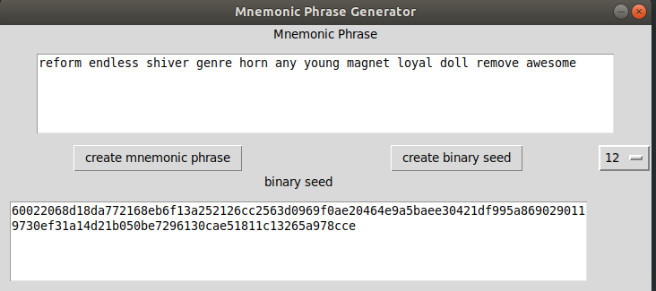
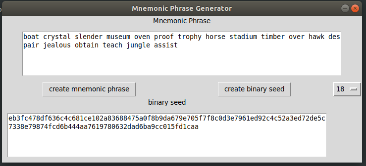

# BIP39
An implementation of BIP 39
## Warning, use this product at your own risk. Mnemonic Phrases and Binary Seed are in no way guarenteed to be secure. Do not use this tool to store or transfer any cryptocurrencies of any value!!!

## This project does the following 
* Create a Mnemonic Phrase to generate a Bitcoin Address
* Receives a user-input mnemonic phrase to generate a 512 bit binary seed
* Provide a GUI for users to bypass the terminal when using these functions

## The Hashing Functions are split into the following steps
* Entropy Generation 
  *The user types in a random value on the keyboard to generate an input
 * Hashing of the Entropy into a 256 bit number
 * Creating a check-sum value to further randomize the user input
 * Split the entropy value into 11 bit chunks
  * 11 bits can represent unsigned integers between 0 to 2047
  * Each set of bits is used to select a word from the provided words.txt file
  * The words are output to the user for them to write down and keep in a safe space
 * The provided word list is hashed into a 256 bit number
 
 ## The GUI functions create an interface with the following elements
 * A box that displays a mnemonic phrase. A user can also paste their own phrase into the box
 * A button that creates entropy. Rite now it uses Python's random library, but eventually I want to tie the user_input function into this button
  * This button also creates a word list to display to the mnemonic phrase box, and a 512 bit binary seed
 * A field to display a private key generated from a word list
 * A button to create a private key from a word list
 
 ## The following Python Libraries were used in this program
 * HashLib
 * Random
 * Tkinter
## Do not use the private keys shown in the screen shots below. Any funds sent to them will not be secure !!!!!

#### example 1

#### example 2

#### example 3

#### example 4
